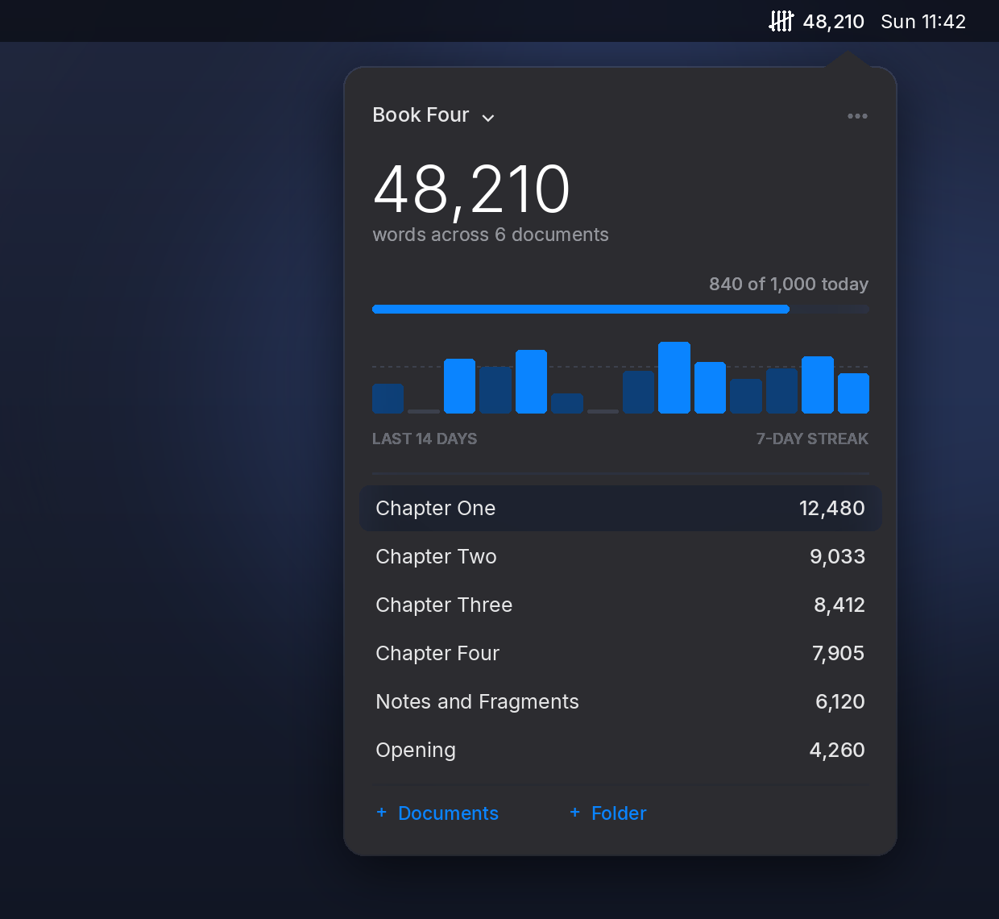

<!-- assets/hero.png is a rendering of the interface. Replace it with a real
     screenshot (Shift-Cmd-4, then Space, then click the panel) when convenient. -->
<p align="center">
  
</p>

<h1 align="center">Tally</h1>

<p align="center">
  <strong>Live word counts for the documents you are writing — in your Mac menu bar.</strong>
</p>

<p align="center">
  <a href="LICENSE"></a>
  
  
</p>

---

Writing a book means living with a number. How many words today? How many
altogether? Are the chapters balanced? The usual answer is to open every file
in Word, read the little count at the bottom, and add them up on your fingers.

Tally does that for you, continuously. Point it at the documents you are
working on and the total sits in your menu bar, updating the moment you press
save.

## What it does

- **Counts a selection of documents, not just one.** Add individual `.docx`
  files, whole folders, or both. The chapters of a book, the drafts scattered
  across two directories — whatever the shape of the work.
- **Updates in real time.** A filesystem watcher notices the save; the number
  moves. There is no refresh button to remember (there is one anyway, in the
  menu, for the rare occasion a network drive misbehaves).
- **Knows what you wrote today.** Not just the total, but the difference
  between now and where the day started — which is the number that actually
  tells you whether you have written.
- **Keeps a daily goal.** Set a target and a slim bar shows how close you are.
  A fourteen-day chart underneath shows the shape of the last fortnight, and
  hovering any bar tells you that day's figure.
- **Separates projects.** "Book Four", "BMJ column", "The talk in October" —
  each with its own documents, its own goal, its own history.
- **Counts what Word counts.** Text in tables, text boxes and content
  controls, not merely the top-level paragraphs. Word's own lock files
  (`~$chapter.docx`) are ignored.
- **Stays out of the way.** No dock icon, no window, no account, no network
  access of any kind. Your documents are read; nothing leaves your machine.

Plain text and Markdown files (`.txt`, `.md`) are counted too, for anyone who
drafts outside Word.

## Installing

### From a release

1. Download `Tally.zip` from the [latest release](../../releases/latest) and
   unzip it.
2. Drag **Tally.app** to your Applications folder.
3. The first time, **right-click the app and choose Open**, then confirm.

That third step is macOS being careful about software from a developer it
cannot verify — which is to say, unsigned software, which is to say, most open
source Mac apps. A paid Apple Developer certificate is the only thing that
removes it. If you would rather not take a stranger's word for what the app
does, build it yourself from source; it takes about a minute.

macOS will also ask, the first time, for permission to read your Documents
folder or Desktop. Tally reads the documents you point it at, and nothing else.

### From source

```bash
git clone https://github.com/jzm8mpgm/tally.git
cd tally
python3 -m venv .venv && source .venv/bin/activate
pip install -r requirements.txt
python3 -m tally
```

To build a standalone `Tally.app`:

```bash
./build.sh
```

The finished app lands in `dist/Tally.app`.

## Using it

Click the tally mark in the menu bar and the panel opens.

| | |
|---|---|
| **+ Documents** | Pick one or more files to count |
| **+ Folder** | Watch a folder — every document inside it counts, subfolders included |
| **Click a document** | Opens it in Word |
| **Right-click a document** | Reveal in Finder, or remove it from the project |
| **Project name** | Switch project, or create, rename and delete them |
| **⋯** | Daily goal, what the menu bar shows, open at login |
| **Right-click the menu bar icon** | A quick summary without opening the panel |

The menu bar itself can show the running total, the words written today, or
nothing but the icon.

## How the counting works

Tally reads `.docx` files directly as the OOXML packages they are — a zip
containing XML — rather than through a document library. That is why counting
sixty thousand words takes milliseconds, and why the app has almost no
dependencies.

A "word" is a run of characters between whitespace, which is how Word counts
too. Tokens made only of punctuation (a lone em dash marking a scene break, a
row of asterisks) are not counted, so Tally's figure can sit a word or two
below Word's on a heavily formatted manuscript. Footnotes, endnotes, comments,
headers and footers are excluded, matching Word's default.

A document whose size and modification time have not changed is never re-read,
so the once-a-second check costs essentially nothing.

## Where your data lives

One small JSON file:

```
~/Library/Application Support/Tally/state.json
```

It holds your projects, the paths you added, your goals, and the daily history
that draws the chart. Delete it and Tally starts again from nothing. Nothing is
sent anywhere — Tally makes no network connections at all.

## Requirements

- macOS 11 Big Sur or later, Apple silicon or Intel
- Python 3.9+ if running from source (macOS ships with a suitable Python)

Two dependencies: `pyobjc-framework-Cocoa` for the interface, and `watchdog`
for the filesystem events. Word documents are parsed with the standard library.

## If it helps you, help 2wish

Tally is free, and I am not asking for anything for it. If it has earned
something from you, [give it to **2wish**](https://2wish.enthuse.com/donate?utm_source=tally&utm_medium=github&utm_campaign=tally-for-2wish#!/)
instead.

2wish supports families bereaved by the sudden and unexpected death of a
child or young adult — the phone call no one is ready for, and the months
afterwards when everyone else has gone back to work. I am an ambassador for
them, which is to say I have seen what they do.

The donation form has a message box. If you put *Tally* in it, they will know
where you came from.

## Contributing

Issues and pull requests are welcome — see [CONTRIBUTING.md](CONTRIBUTING.md).
Run the tests with:

```bash
python3 -m unittest discover -s tests -t .
```

## Licence

MIT. See [LICENSE](LICENSE).
